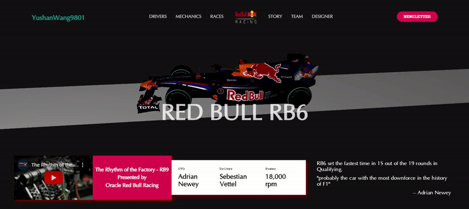

Create a Visual exploration | Redbull RB6 website header

Using three.js



to run this project locally:

```
npm create vite@latest

npm install three gsap

npm run dev
```

Demo of this project: 
https://yushanwang9801.github.io/rb6_dribble/

You can check out the tutorial at medium:
https://medium.com/@wang33he77/formula1-rb6-dashboard-with-three-js-part-i-a8948a3893ff

